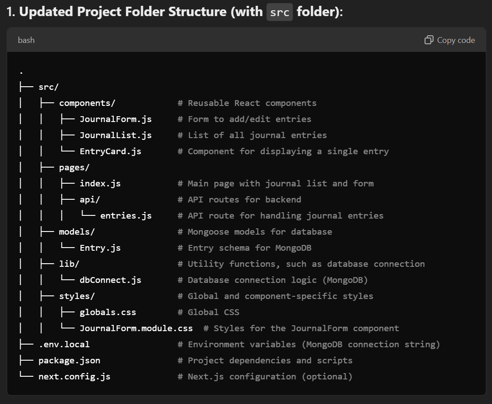
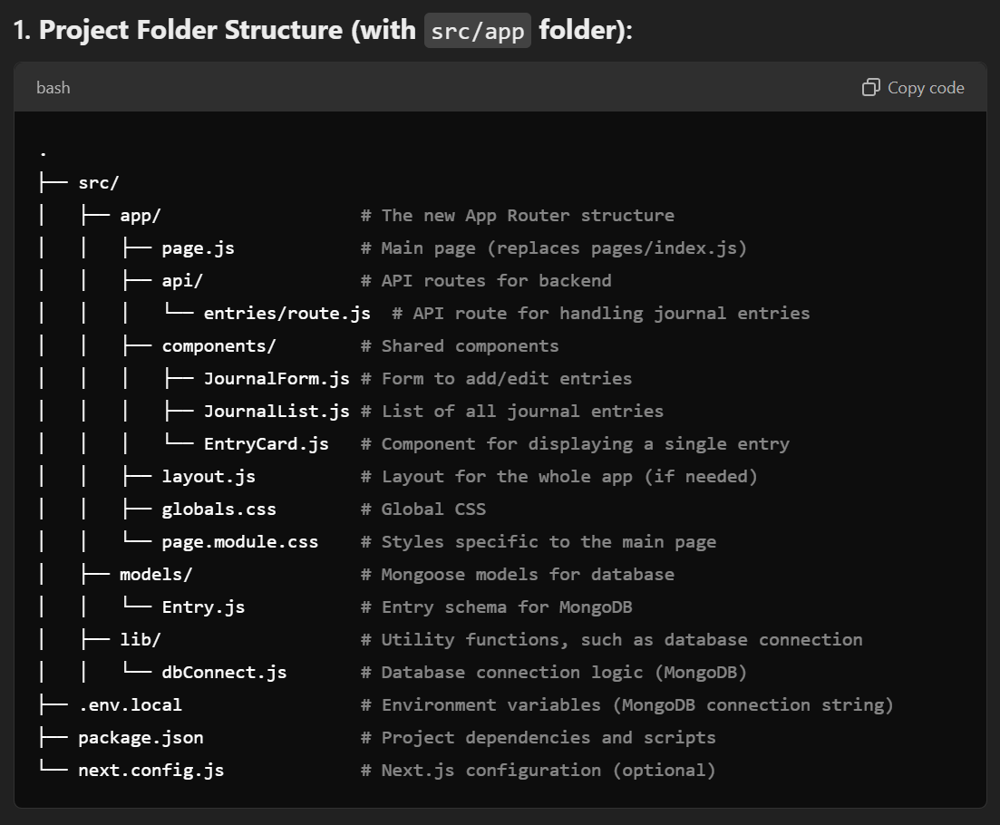

This is a [Next.js](https://nextjs.org) project bootstrapped with [`create-next-app`](https://nextjs.org/docs/app/api-reference/cli/create-next-app).

## Getting Started

First, run the development server:

```bash
npm run dev
# or
yarn dev
# or
pnpm dev
# or
bun dev
```

Open [http://localhost:3000](http://localhost:3000) with your browser to see the result.

You can start editing the page by modifying `app/page.js`. The page auto-updates as you edit the file.

This project uses [`next/font`](https://nextjs.org/docs/app/building-your-application/optimizing/fonts) to automatically optimize and load [Geist](https://vercel.com/font), a new font family for Vercel.

## Learn More

To learn more about Next.js, take a look at the following resources:

- [Next.js Documentation](https://nextjs.org/docs) - learn about Next.js features and API.
- [Learn Next.js](https://nextjs.org/learn) - an interactive Next.js tutorial.

You can check out [the Next.js GitHub repository](https://github.com/vercel/next.js) - your feedback and contributions are welcome!

## Deploy on Vercel

The easiest way to deploy your Next.js app is to use the [Vercel Platform](https://vercel.com/new?utm_medium=default-template&filter=next.js&utm_source=create-next-app&utm_campaign=create-next-app-readme) from the creators of Next.js.

Check out our [Next.js deployment documentation](https://nextjs.org/docs/app/building-your-application/deploying) for more details.


# Project Folder Structure (with Next.js):

<br>
.
├── components/ # Reusable React components
│ ├── JournalForm.js # Form to add/edit entries
│ ├── JournalList.js # List of all journal entries
│ └── EntryCard.js # Component for displaying a single entry
├── pages/
│ ├── index.js # Main page with journal list and form
│ ├── api/ # API routes for backend
│ │ ├── entries.js # API route for handling journal entries
│ └── \_app.js # Custom app component (global CSS or state management)
├── models/ # Mongoose models for database
│ └── Entry.js # Entry schema for MongoDB
├── lib/ # Utility functions, such as database connection
│ └── dbConnect.js # Database connection logic (MongoDB)
├── styles/ # Global and component-specific styles
│ ├── globals.css # Global CSS
│ └── JournalForm.module.css # Styles for the JournalForm component
├── .env.local # Environment variables (MongoDB connection string)
├── package.json # Project dependencies and scripts
└── next.config.js # Next.js configuration (optional)

# Frontend (React + Next.js pages)

<br>1. Components Folder:
<br>
JournalForm.js: This component will allow users to add or edit entries in the journal.
<br>
JournalList.js: Displays the list of entries added so far.
<br>
EntryCard.js: Individual card to display each journal entry in the list.
<br> 2. Pages Folder:
<br>
index.js: This is the main page where the form (JournalForm) and the list of entries (JournalList) will be displayed.
<br>
api/entries.js: This file contains the API logic to handle requests (GET, POST, PUT) for the journal entries. Next.js API routes handle the server-side logic without needing a separate backend framework.
<br>
\_app.js: Used to import global CSS or manage state using providers like Redux, React Context, or libraries like SWR for data fetching.

# Backend (Next.js API + MongoDB):

<br> 1. models/Entry.js:

This is a Mongoose model that defines the structure of your journal entries in the MongoDB database.
<br> 2. lib/dbConnect.js:

This is the database connection logic using Mongoose. It ensures a single MongoDB connection is reused across API requests in the development environment.
<br> 3. pages/api/entries.js:

This is the API route where you handle HTTP requests for managing journal entries. It connects to MongoDB and interacts with the Entry model.

# Styles:

Global styles (globals.css) and component-specific styles (e.g., JournalForm.module.css) are stored here. Each component can have its own .module.css file for scoped styles.

# Environment Variables:

Store the MongoDB connection string in .env.local

# 3. Steps to Build the Project:

1. Set up Next.js project:

```bash
npx create-next-app client-journal
cd client-journal
npm install mongoose
```

<br>
2. Create Components: Build JournalForm, JournalList, and EntryCard in the components/ folder, following the form structure discussed earlier.
<br>
3. Create Backend API: Add your MongoDB connection in lib/dbConnect.js and define API routes in pages/api/entries.js.
<br>
4. Connect Frontend to Backend: Use fetch or axios in index.js to connect to the API (/api/entries) and handle CRUD operations for journal entries.
<br>
5. Run the application:

```bash
Copy code
npm run dev
```

This structure allows to maintain a clean separation between frontend (components, styling) and backend (API routes, database logic), and fully leverages the power of Next.js as a full-stack framework.

# Frontend (React):

Components:

FormComponent: for adding/editing records (with fields for task, customer consent, due date, and result).
JournalComponent: for displaying all records, with the ability to edit them.
TaskListComponent: for displaying current tasks and tracking the status.
Main record fields:

Record date: filled in automatically, but must be editable.
Action/task: task text.
Customer consent: checkbox or field for marking consent.
Date of completion: input field, when filled in, automatically copies the description from the task to the result description.
Result description: text field for displaying the result with the ability to edit.
Logic for copying the task to the result: When the "Date of completion" field in the form changes, automatically fill in the result description with the same text as the task, with the ability to edit it.

Record storage:

Create a state for storing records as a list of objects.
Implement the functionality for adding, editing, and saving changes, without deleting records by default.

# Use Folder src

.
├── src/
│ ├── components/ # Reusable React components
│ │ ├── JournalForm.js # Form to add/edit entries
│ │ ├── JournalList.js # List of all journal entries
│ │ └── EntryCard.js # Component for displaying a single entry
│ ├── pages/
│ │ ├── index.js # Main page with journal list and form
│ │ ├── api/ # API routes for backend
│ │ │ └── entries.js # API route for handling journal entries
│ ├── models/ # Mongoose models for database
│ │ └── Entry.js # Entry schema for MongoDB
│ ├── lib/ # Utility functions, such as database connection
│ │ └── dbConnect.js # Database connection logic (MongoDB)
│ ├── styles/ # Global and component-specific styles
│ │ ├── globals.css # Global CSS
│ │ └── JournalForm.module.css # Styles for the JournalForm component
├── .env.local # Environment variables (MongoDB connection string)
├── package.json # Project dependencies and scripts
└── next.config.js # Next.js configuration (optional)

# Key Changes:

All your core project files are now under the src/ directory, which is common for organizing Next.js projects.
Your API routes are still in src/pages/api/, and everything else follows a similar structure as discussed earlier.



# we use next 14 with src/app

.
├── src/
│ ├── app/ # The new App Router structure
│ │ ├── page.js # Main page (replaces pages/index.js)
│ │ ├── api/ # API routes for backend
│ │ │ └── entries/route.js # API route for handling journal entries
│ │ ├── components/ # Shared components
│ │ │ ├── JournalForm.js # Form to add/edit entries
│ │ │ ├── JournalList.js # List of all journal entries
│ │ │ └── EntryCard.js # Component for displaying a single entry
│ │ ├── layout.js # Layout for the whole app (if needed)
│ │ ├── globals.css # Global CSS
│ │ └── page.module.css # Styles specific to the main page
│ ├── models/ # Mongoose models for database
│ │ └── Entry.js # Entry schema for MongoDB
│ ├── lib/ # Utility functions, such as database connection
│ │ └── dbConnect.js # Database connection logic (MongoDB)
├── .env.local # Environment variables (MongoDB connection string)
├── package.json # Project dependencies and scripts
└── next.config.js # Next.js configuration (optional)



# 2. Key Files in App Router:

src/app/page.js: This is the main page for your journal application, similar to pages/index.js in the old routing system.
<br>
src/app/api/entries/route.js: This is where you define your API route for handling journal entries. In the new App Router, API routes go inside api/[route] directories, and the route logic is defined inside route.js.
<br>
src/app/components/: This is where you store your reusable React components like JournalForm, JournalList, and EntryCard.
<br>
src/app/layout.js: This file can be used to define the layout that will be shared across all pages, such as navigation bars or footers.
<br>
src/app/globals.css: Global CSS that applies throughout the entire application.
<br>
src/app/page.module.css: This is the CSS module specific to the main page (page.js), which can be used for scoping styles.

# 3. API Route (src/app/api/entries/route.js):

This would replace the old API route from pages/api/entries.js.

# 4. Main Page (src/app/page.js)

#

If you're using the new App Router feature with the src/app directory (introduced in Next.js 13), here's how the structure of your journal application would look with the src/app folder instead of the pages directory.

1. Project Folder Structure (with src/app folder):
   bash
   Copy code
   .
   ├── src/
   │ ├── app/ # The new App Router structure
   │ │ ├── page.js # Main page (replaces pages/index.js)
   │ │ ├── api/ # API routes for backend
   │ │ │ └── entries/route.js # API route for handling journal entries
   │ │ ├── components/ # Shared components
   │ │ │ ├── JournalForm.js # Form to add/edit entries
   │ │ │ ├── JournalList.js # List of all journal entries
   │ │ │ └── EntryCard.js # Component for displaying a single entry
   │ │ ├── layout.js # Layout for the whole app (if needed)
   │ │ ├── globals.css # Global CSS
   │ │ └── page.module.css # Styles specific to the main page
   │ ├── models/ # Mongoose models for database
   │ │ └── Entry.js # Entry schema for MongoDB
   │ ├── lib/ # Utility functions, such as database connection
   │ │ └── dbConnect.js # Database connection logic (MongoDB)
   ├── .env.local # Environment variables (MongoDB connection string)
   ├── package.json # Project dependencies and scripts
   └── next.config.js # Next.js configuration (optional)
2. Key Files in App Router:
   src/app/page.js: This is the main page for your journal application, similar to pages/index.js in the old routing system.

src/app/api/entries/route.js: This is where you define your API route for handling journal entries. In the new App Router, API routes go inside api/[route] directories, and the route logic is defined inside route.js.

src/app/components/: This is where you store your reusable React components like JournalForm, JournalList, and EntryCard.

src/app/layout.js: This file can be used to define the layout that will be shared across all pages, such as navigation bars or footers.

src/app/globals.css: Global CSS that applies throughout the entire application.

src/app/page.module.css: This is the CSS module specific to the main page (page.js), which can be used for scoping styles.

3. API Route (src/app/api/entries/route.js):
   This would replace the old API route from pages/api/entries.js. Here’s an example for the route.js file:

javascript
Copy code
import dbConnect from '@/lib/dbConnect';
import Entry from '@/models/Entry';

export async function GET(request) {
await dbConnect();
const entries = await Entry.find({});
return new Response(JSON.stringify({ success: true, data: entries }), { status: 200 });
}

export async function POST(request) {
await dbConnect();
const body = await request.json();
const entry = await Entry.create(body);
return new Response(JSON.stringify({ success: true, data: entry }), { status: 201 });
}

export async function PUT(request) {
await dbConnect();
const { id, ...updateData } = await request.json();
const updatedEntry = await Entry.findByIdAndUpdate(id, updateData, { new: true });
return new Response(JSON.stringify({ success: true, data: updatedEntry }), { status: 200 });
} 4. Main Page (src/app/page.js):
javascript
Copy code
import JournalForm from './components/JournalForm';
import JournalList from './components/JournalList';

export default function Home() {
return (
<main>
<h1>Client Development Journal</h1>
<JournalForm />
<JournalList />
</main>
);
}

# 5. Connecting to MongoDB (src/lib/dbConnect.js):

The MongoDB connection logic would remain the same as before. The only change is that imports now follow the path from src/lib/.

# Summary of Structure Changes:

src/app replaces the pages directory.
API routes are now inside src/app/api/[name]/route.js.
The layout is managed globally with src/app/layout.js.
Components, models, and utility functions remain in their respective folders (src/components/, src/models/, src/lib/).
<br>
This structure makes use of Next.js' new file-based routing system under the App Router, giving you more flexibility with layouts and server-side rendering capabilities.

# favicon
```
<svg xmlns="http://www.w3.org/2000/svg" viewBox="0 0 100 100" width="100" height="100">

  <!-- House Shape -->
  <polygon points="50,10 90,40 90,90 10,90 10,40" fill="#4CAF50" stroke="#2E7D32" stroke-width="4"/>

  <!-- Roof -->
  <polygon points="50,5 95,40 5,40" fill="#8BC34A" stroke="#2E7D32" stroke-width="4"/>

  <!-- Hammer Shape -->
  <rect x="40" y="50" width="8" height="30" fill="#FFC107" />
  <rect x="30" y="60" width="30" height="8" fill="#FFC107" />
  <rect x="30" y="50" width="30" height="5" fill="#FFC107" />

  <!-- Window -->
  <rect x="60" y="60" width="15" height="15" fill="white" stroke="#2E7D32" stroke-width="2"/>
</svg>
```

# files structure

DiaryApp.js
├── State: entries (list of diary entries)
├── State: editEntry (currently edited entry)
├── Functions: addEntry, handleEdit, handleDelete
└── Renders:
    ├── JournalForm (passes addEntry and editEntry)
    └── JournalList (passes entries, handleEdit, handleDelete)

JournalForm.js
├── State: task, customerConsent, completionDate, description (form fields)
├── Effect: populates form when editing an entry
└── Handles submission: calls addEntry (passed from DiaryApp) with new or edited entry

